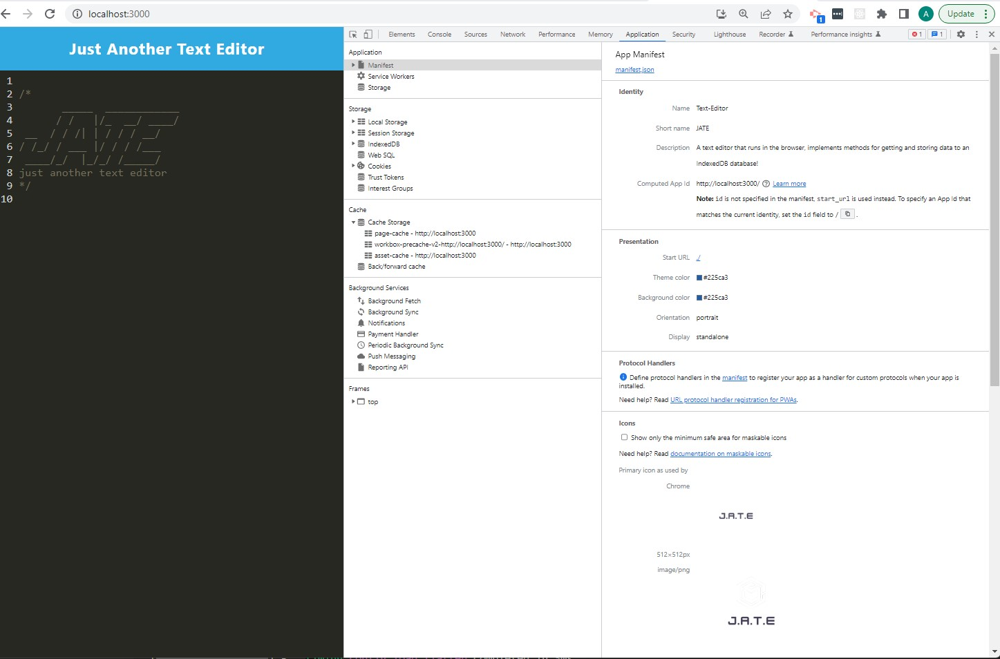
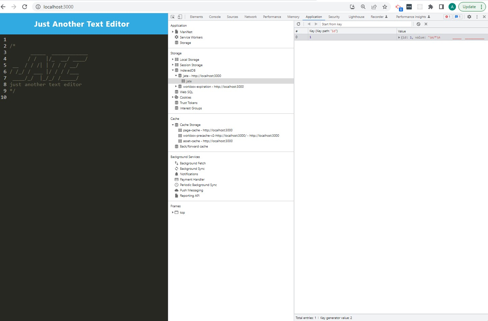

# Text-Editor

## Description

A short description explaining the what, why, and how of project "Employee-Tracker":

A text editor that runs in the browser. The app is a single-page application that meets the PWA criteria. Additionally, it features a number of data persistence techniques that serve as redundancy in case one of the options is not supported by the browser. The application will also function offline.

The application implements methods for getting and storing data to an IndexedDB database. The app uses a package called idb, which is a lightweight wrapper around the IndexedDB API. It features a number of methods that are useful for storing and retrieving data.

This application is als deployed to Heroku. 

## User Story

AS A developer

I WANT to create notes or code snippets with or without an internet connection

SO THAT I can reliably retrieve them for later use

## Acceptance Criteria

GIVEN a text editor web application

WHEN I open my application in my editor

THEN I should see a client server folder structure

WHEN I run `npm run start` from the root directory

THEN I find that my application should start up the backend and serve the client

WHEN I run the text editor application from my terminal

THEN I find that my JavaScript files have been bundled using webpack

WHEN I run my webpack plugins

THEN I find that I have a generated HTML file, service worker, and a manifest file

WHEN I use next-gen JavaScript in my application

THEN I find that the text editor still functions in the browser without errors

WHEN I open the text editor

THEN I find that IndexedDB has immediately created a database storage

WHEN I enter content and subsequently click off of the DOM window

THEN I find that the content in the text editor has been saved with IndexedDB

WHEN I reopen the text editor after closing it

THEN I find that the content in the text editor has been retrieved from our IndexedDB

WHEN I click on the Install button

THEN I download my web application as an icon on my desktop

WHEN I load my web application

THEN I should have a registered service worker using workbox

WHEN I register a service worker

THEN I should have my static assets pre cached upon loading along with subsequent pages and static assets

WHEN I deploy to Heroku

THEN I should have proper build scripts for a webpack application

## Installation

Pulling the GitHub repository from the follwing URL: https://github.com/RamRod79/Text-Editor.git and typing the follwoing command ,'npm install', in the terminal will ensure the dependencies are installed and the program can run properly.

- Download and run mysql server.

- Download the repository to your own local machine and run it from your command line.

- Run ```npm i``` or ```npm install``` in order to download all the dependencies.

- MySQL instructions to create your tables:

        - Enter ```mysql -u root -p``` in the terminal window.
        - Enter your mysql password. 
        - Create database by entering ```CREATE DATABASE employeeTracker_db;``` and enter.
        - Then enter ```SHOW databases;```.
        - To use the employees database; enter ```USE employeeTracker_db;```.
        - In order to use your .sql files enter ```source db/schema.sql;``` and enter, then type ```source db/seeds.sql;``` and enter.
        - Exit MySQL by entering ```quit;```.
  
  Run ```node index.js``` or ```npm start``` in your terminal to satrt.

## Usage




## Credits

List of collaborators:

- UCLA Extension, Coding Bootcamp Instructor and TAs

## License

The following licenses have been used in the development of this project:

[](https://opensource.org/licenses/MIT)

## Badges


## Repo Features

Using this repo can be initiated by running 'npm run Start' in the command terminal after opening the integrated terminal to initiate the program. Using this repo requires express and nodemon, and updated node modules to ensure application runs properly.

## How to Contribute

If other developers would like to contribute, you can contact me at armando.rod79@gmail.com.

## URL
GitHub: https://github.com/RamRod79/Text-Editor.git

Deployed URL: https://drive.google.com/file/

## Contact Info

For any other issues or comments please contact me at:

GitHub username: RamRod79

Email: armando.rod79@gmail.com